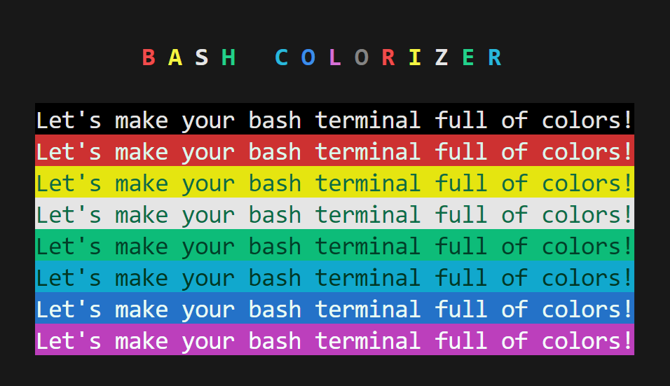
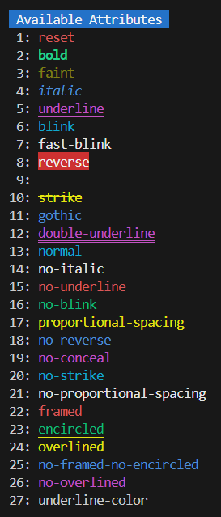
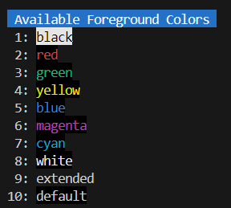

# BASH COLORIZER



## 1. Features

`Bash Colorizer` outputs strings in specified colors and attributes.

Let's make your `bash` terminal full of colors!

## 2. Contents

- [1. Features](#1-features)
- 2\. Contents
- [3. Verified Terminals](#3-verified-terminals)
- [4. Requirements](#4-requirements)
- [5. Installation](#5-installation)
- [6. Usage](#6-usage)
    - [6.1. Basic Usage](#61-basic-usage)
    - [6.2. Available Attributes](#62-available-attributes)
    - [6.3. Available Colors](#63-available-colors)
- [7. Examples](#7-examples)
- [8. LICENSE](#8-license)

## 3. Verified Terminals

- VSCode Terminal (VSCode 1.99.1 / Windows 11)
- Windows Terminal 1.22.10731.0

## 4. Requirements

- PHP 8.1 or later installed
- Composer v2 installed
- Bash v5 installed

## 5. Installation

```bash
composer require macocci7/bash-colorizer
```

## 6. Usage

### 6.1. Basic Usage

- Import composer's `autoload.php` at first.

    ```php
    <?php

    require_once __DIR__ . '/../vendor/autoload.php';
    ```

- Displaying messages:

    static calls:
    ```php
    use Macocci7\BashColorizer\Colorizer;

    Colorizer::echo("Hi, there!");
    Colorizer::echo(" How's it going with you?", PHP_EOL);
    ```

    method chains:
    ```php
    Colorizer::echo("Hi, there!");
        ->echo(" How's it going with you?", PHP_EOL);
    ```

    creating an instance:
    ```php
    $colorizer = new Colorizer;
    $colorizer->("Hi, there!")
        ->echo(" How's it going with you?", PHP_EOL);
    ```

- Configuration:

    static call:
    ```php
    $config = [
        'attributes' => ['italic', 'bold'],
        'foreground' => 'black',
        'background' => 'green',
    ];

    Colorizer::config($config);
    Colorizer::echo("Hi, there!");
    ```

    method chain:
    ```php
    Colorizer::config($config)
        ->echo("Hi, there!");
    ```

    creating an instance:
    ```php
    // several ways
    $colorizer = new Colorizer;
    $colorizer = new Colorizer($config);
    $colorizer = Colorizer::config($config);

    $colorizer->config($config)
        ->echo("Hi, there!")
        ->echo(" How's it going with you?", PHP_EOL);
    ```

- Setting attributes:

    ```php
    Colorizer::attributes(['underline', 'strike'])
        ->echo("Hi, there!", PHP_EOL);
    ```

    See more: [Available Attributes](#62-available-attributes)

- Setting foreground color:

    ```php
    Colorizer::foreground('green')
        ->echo("Hi, there!", PHP_EOL);
    ```

    See more: [Available Colors](#63-available-colors)

- Setting background color:

    ```php
    Colorizer::background("red")
        ->echo("Hi, there!", PHP_EOL);
    ```

    See more: [Available Colors](#63-available-colors)

- Equivalent to `config()`:

    ```php
    Colorizer::attributes(['double-underline', 'italic'])
        ->foreground("yellow")
        ->background("blue")
        ->echo("Hi, there!", PHP_EOL);
    ```

- Returning colorized string:

    As an argument of echo:
    ```php
    echo Colorizer::config($config)
        ->encode("Hi, there!") . PHP_EOL;
    ```
 
    This is also effective:
    ```php
    echo sprintf(
        "%s: %s%s",
        $name,
        Colorizer::config($config)
            ->encode("Hi, there!"),
        PHP_EOL
    );
    ```

### 6.2. Available Attributes

- `reset`
- `bold`
- `faint`
- `italic`
- `underline`
- `blink`
- `fast-blink`
- `reverse`
- `conceal`
- `strike`
- `gothic`
- `double-underline`
- `normal`
- `no-italic`
- `no-underline`
- `no-blink`
- `no-reverse`
- `no-conceal`
- `no-strike`

e.g.) on VSCode Terminal



### 6.3. Available Colors

`foreground`/`background`:

- `black`
- `red`
- `green`
- `yellow`
- `blue`
- `magenta`
- `cyan`
- `white`
- `extended`
- `default`


e.g.) on VSCode Terminal
|Foregound Colors|Background Colors|
|---|---|
|||

## 7. Examples

Example codes are in [playground](playground/) directory.

- [colorizer.php](playground/colorizer.php)
- [attributes.php](playground/attributes.php)
- [foreground.php](playground/foreground.php)
- [background.php](playground/background.php)

## 8. LICENSE

[MIT](LICENSE)

Copyright 2025 macocci7.
