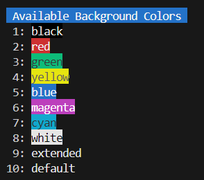

# BASH COLORIZER


## 1. Features

`Bash Colorizer` outputs strings in specified colors and attributes.

Let's make your `bash` terminal full of colors!

## 2. Contents

- [1. Features](#1-features)
- 2\. Contents
- [3. Verified Terminals](#3-verified-terminals)
- [4. Requirements](#4-requirements)
- [5. Installation](#5-installation)
- [6. Usage](#6-usage)
    - [6.1. Basic Usage](#61-basic-usage)
    - [6.2. Available Attributes](#62-available-attributes)
    - [6.3. Available Colors](#63-available-colors)
- [7. Examples](#7-examples)
- [8. LICENSE](#8-license)

## 3. Verified Terminals

- VSCode Terminal (VSCode 1.99.1 / Windows 11)
- Windows Terminal 1.22.10731.0

## 4. Requirements

- PHP 8.1 or later installed
- Composer v2 installed
- Bash v5 installed

## 5. Installation

```bash
composer require macocci7/bash-colorizer
```

## 6. Usage

### 6.1. Basic Usage

- Import composer's `autoload.php` at first.

    ```php
    <?php

    require_once __DIR__ . '/../vendor/autoload.php';
    ```

- Displaying messages:

    static calls:
    ```php
    use Macocci7\BashColorizer\Colorizer;

    Colorizer::echo("Hi, there!");
    Colorizer::echo(" How's it going with you?", PHP_EOL);
    ```

    method chains:
    ```php
    Colorizer::echo("Hi, there!");
        ->echo(" How's it going with you?", PHP_EOL);
    ```

    creating an instance:
    ```php
    $colorizer = new Colorizer;
    $colorizer->echo("Hi, there!")
        ->echo(" How's it going with you?", PHP_EOL);
    ```

- Configuration:

    static call:
    ```php
    $config = [
        'attributes' => ['italic', 'bold'],
        'foreground' => 'black',
        'background' => 'green',
    ];

    Colorizer::config($config);
    Colorizer::echo("Hi, there!");
    ```

    method chain:
    ```php
    Colorizer::config($config)
        ->echo("Hi, there!");
    ```

    creating an instance:
    ```php
    // several ways
    $colorizer = new Colorizer;
    $colorizer = new Colorizer($config);
    $colorizer = Colorizer::config($config);

    $colorizer->config($config)
        ->echo("Hi, there!")
        ->echo(" How's it going with you?", PHP_EOL);
    ```

- Setting attributes:

    ```php
    Colorizer::attributes(['underline', 'strike'])
        ->echo("Hi, there!", PHP_EOL);
    ```

    See more: [Available Attributes](#62-available-attributes)

- Setting foreground color:

    by name:
    ```php
    Colorizer::foreground('green')
        ->echo("Hi, there!", PHP_EOL);
    ```

    by number [0 - 255] (256 colors):
    ```php
    Colorizer::foreground(2)
        ->echo("Hi, there!", PHP_EOL);
    ```

    by (RGB) array (24bit 16777216 colors):
    ```php
    Colorizer::foreground([0, 255, 0])
        ->echo("Hi, there!", PHP_EOL);
    ```

    See more: [Available Colors](#63-available-colors)

- Setting background color:

    by name:
    ```php
    Colorizer::background("red")
        ->echo("Hi, there!", PHP_EOL);
    ```

    by number [0 - 255] (256 colors):
    ```php
    Colorizer::background(1)
        ->echo("Hi, there!", PHP_EOL);
    ```

    by (RGB) array (24bit 16777216 colors):
    ```php
    Colorizer::background([255, 0, 0])
        ->echo("Hi, there!", PHP_EOL);
    ```

    See more: [Available Colors](#63-available-colors)

- Equivalent to `config()`:

    ```php
    Colorizer::attributes(['double-underline', 'italic'])
        ->foreground("yellow")
        ->background("blue")
        ->echo("Hi, there!", PHP_EOL);
    ```

- Returning colorized string:

    As an argument of echo:
    ```php
    echo Colorizer::config($config)
        ->encode("Hi, there!") . PHP_EOL;
    ```
 
    This is also effective:
    ```php
    echo sprintf(
        "%s: %s%s",
        $name,
        Colorizer::config($config)
            ->encode("Hi, there!"),
        PHP_EOL
    );
    ```

- Returning human readable encoded string:

    ```php
    echo Colorizer::attributes(["bold"])
        ->background([255, 255, 0])
        ->foreground([0, 128, 255])
        ->readable('Hi, There!', PHP_EOL);
    ```
    This code outputs the following string:
    ```bash
    \033[1;38;2;0;128;255;48;2;255;255;0mHi, there!\033[m
    ```
    Running bash command `echo` with `-e` option on this string takes colorizing effect:
    ```bash
    bash-$ echo -e '\033[1;38;2;0;128;255;48;2;255;255;0mHi, there!\033[m'
    ```

### 6.2. Available Attributes
|Attribute|VSCode Terminal|Windows Terminal|
|:---|:---:|:---:|
|`reset`|〇|〇|
|`bold`|〇|❌|
|`faint`|〇|〇|
|`italic`|〇|〇|
|`underline`|〇|〇|
|`blink`|❌|▲<br><a href="#note1">*1</a>|
|`fast-blink`|❌|▲<br><a href="#note1">*1</a>, <a href="#note2">*2</a>|
|`reverse`|〇|〇|
|`conceal`|〇|〇|
|`strike`|〇|〇|
|`gothic`|❌|❌|
|`double-underl ine`|〇|〇|
|`normal`|〇|〇|
|`no-italic`|〇|〇|
|`no-underline`|〇|〇|
|`no-blink`|ー<br><a href="#note3">*3</a>|〇<br><a href="#note4">*4</a>|
|`no-reverse`|〇|〇|
|`no-conceal`|〇|〇|
|`no-strike`|〇|〇|

> <a id="note1"></a>
*1: No effect with `faint`<br>
> <a id="note2"></a>
*2: Not `fast` (blinks at the same rate as `blink`)<br>
> <a id="note3"></a>
*3: Unknown because `blink` has no effect<br>
> <a id="note4"></a>
*4: Also effective against `fast-blink`<br>

e.g.) on VSCode Terminal


### 6.3. Available Colors

- `foreground`/`background` color names:

    - `black`
    - `red`
    - `green`
    - `yellow`
    - `blue`
    - `magenta`
    - `cyan`
    - `white`
    - ~~`extended`~~ (no effect, only name)
    - `default`


    e.g.) on VSCode Terminal
    |Foregound Colors|Background Colors|
    |---|---|
    |||

- 256 colors [ 0 - 255 ]:

    e.g.) foreground colors on VSCode Terminal:

    

    e.g.) background colors on VSCode Terminal:

    

- 24bit (16777216) colors:

    e.g.) foreground colors on VSCode Terminal:

    

    e.g.) background colors on VSCode Terminal:

    

## 7. Examples

Example codes are in [playground](playground/) directory.

- [colorizer.php](playground/colorizer.php)
- [attributes.php](playground/attributes.php)
- [foreground.php](playground/foreground.php)
- [background.php](playground/background.php)
- [foreground_256colors.php](playground/foreground_256colors.php)
- [foreground_24bitcolors.php](playground/foreground_24bitcolors.php)
- [background_256colors.php](playground/background_256colors.php)
- [background_24bitcolors.php](playground/background_24bitcolors.php)
- [readable.php](playground/readable.php)

## 8. LICENSE

[MIT](LICENSE)

Copyright 2025 macocci7.
